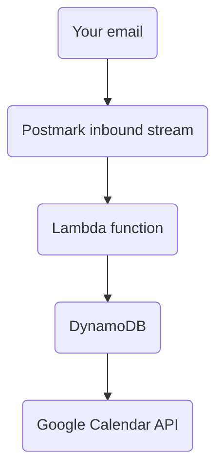

# Schedula

## The problem with emailing back-and-forth - lost time
You want to schedule a meeting with your boss.
He wants you to set up one with him before this week ends.

All good, but one problem:
- You don't know his availability

Yikes.

So you send him an email, asking if he's free after 5PM today.
You wait, but he never checked his email.
It's 5:27PM now.

You send him another email, this time for 6PM tomorrow.

Alas, he missed this email too.
You know how busy a boss of a 100 people team can get!

He replies,
> "Sorry, I missed your emails.
> My calendar was free though, so I wondered why you never set up a call".

Schedula extracts the meeting bits and gets it on your calendar.

## How to use

To test this feature, all you need to do is:
- Address an email to event@cal.learnaws.io (the TO section)
- Coyly mention the date, time, and 

## How does it work

The emails are sent to event@cal.learnaws.io, all of which are then forwarded to the Postmark inbound processing stream.

Postmark then processes the emails on their side and sends a JSON to our AWS Lambda function.\
This JSON contains valuable information about our meeting, like:
- date (5th June 2025)
- time or time range (mentioning times like 12PM automatically schedules a 30-minute range for meeting from 12:00 PM to 12:30 PM)
- timezone (CEST / IST / JST etc.)
- recipient

- Lambda
- DynamoDB (creds)
- Google Calendar API (scheduling the meeting)

